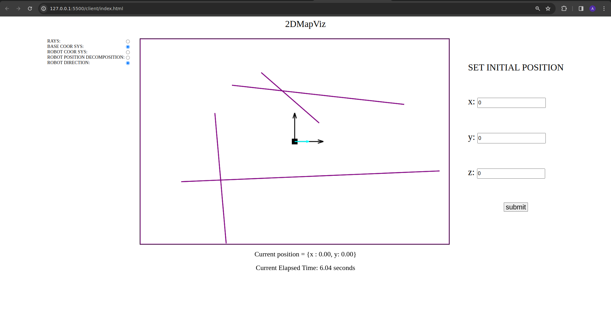
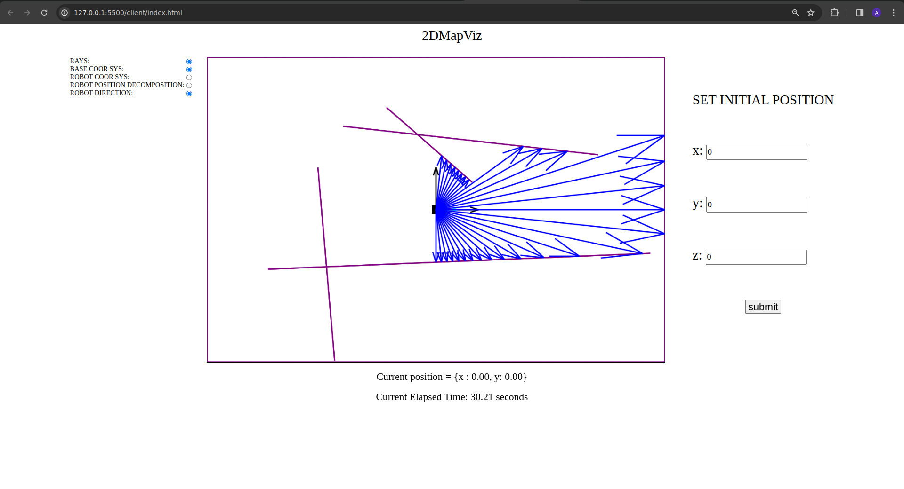

# 2DMAPVIZ

## Very simple visualisation tool to help with the linear algebra aspect of coordinate system mapping and to help vizualize on web interface generated maps from robot environnement

### Most robotic mapping system draw the map in the frame of the robot, so it is important to know how to map from the map system to another one to ease the rendering on the client side and to be able to set an initial position for the robot in regards to anothe frame

## GETTING STARTED

### We need some kind of live server to run the client on a browser (liver server code extension works well) and we need tsc to transpile the source files into javascript

### Transpile typescript source files
```
tsc
```

### Start live server (vscode extention or with python) in the client folder
```
python3 -m http.server 
```
### This will start Serving HTTP requests on 0.0.0.0 port 8000

## Once Started and the 2dVizServer opened, you should have a view like:


### We have a couple options we can enable from the right control panel, for example we can enable showing the lidar rays:


## For now, the left control pannel should be ignored, will maybe be used to input initial robot position.