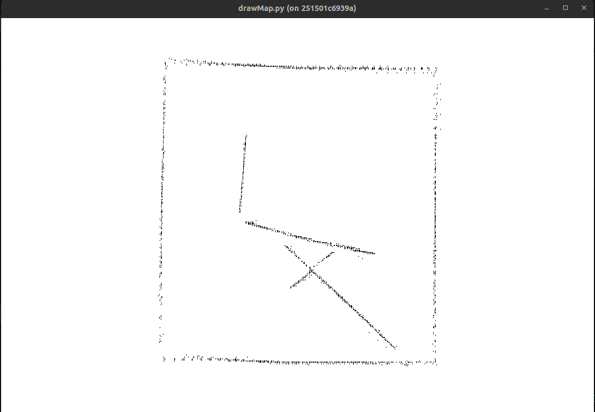

# ROS system example to run with the 2dSimulator

# Basic exploration Example where we can run two kind of algorithm (Random walk and explore_lite node), Support for starting, stopping, changing algorithm and returning to origin.

# Getting started
```
catkin_make
source devel/setup.bash
roslaunch launcher robot.launch
```
## This will start the ros master node as well as the different nodes used by application

### server node to receive requests to robot on port 6001 (own)
### compute node to handle the state of mouvement (own)
### move_base (extern)
### slam_gmmaping (extern)

# Usage
## After having started the application, We can send requests to robot using HTTP GET requests

### TO START : GET http://127.0.0.1:6001/?cmd=start
### TO STOP  : GET http://127.0.0.1:6001/?cmd=stop
### TO CHANGE ALGORITHM: GET http://127.0.0.1:6001/?cmd=change
### TO RETURN TO ORIGIN: GET http://127.0.0.1:6001/?cmd=return

## The thunder client vscode extension works well for sending these types of request to the robot application

# Tools

## drawMap.py Enables the visualization of current mapTopic state, starting the node will draw on a window the current map view for robot:

### For example, given a simulated map view


### After letting the simulation run for a bit, we get the output on the tool (Global global map coordinate system is not the same as the generated map and odom frame, keep that in mind when comparing both pictures):

